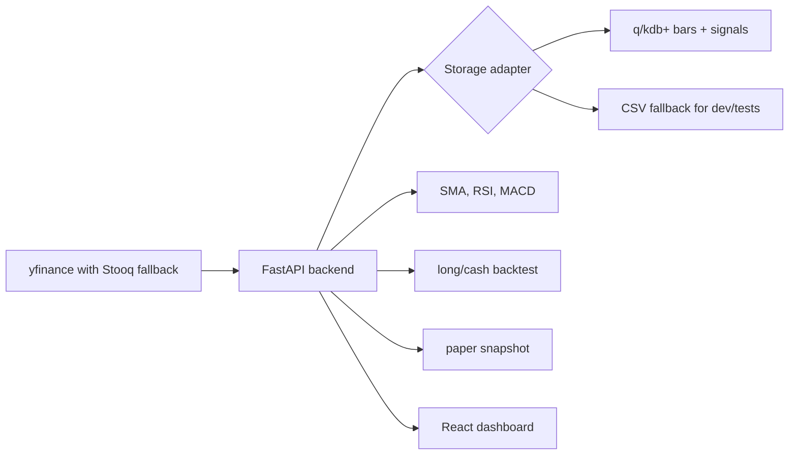

# LLM Handoff: Model Trading Bot

This document is for another LLM or engineer picking up the repo without the original chat context. It explains what exists, how the pieces fit, how to run and verify it, and what is intentionally incomplete.

## Project Intent

The repo is a toy algorithmic trading system that mimics the shape of a financial market-data stack:

- Fetch free historical equity data for a small FAANG-style universe.
- Store daily bars and calculated signals in KDB/q.
- Expose ingestion, signal, backtest, and paper-trading APIs through FastAPI.
- Display the system state in a React dashboard.
- Containerize backend, frontend, and KDB services for Docker Compose and Kubernetes.

This is educational software only. It does not execute real trades and should not be treated as investment advice.

## Current State

The scaffold is implemented end to end:

- `backend/`: FastAPI app, data providers, indicators, storage adapters, backtest, paper snapshot, tests.
- `kdb/`: q schema and container entrypoint for bars/signals persistence.
- `frontend/`: React/Vite/Recharts dashboard.
- `infra/k8s/`: plain Kubernetes YAML for namespace, config, KDB StatefulSet, backend/frontend deployments, services, ingress.
- `docker-compose.yml`: local multi-container topology.
- `README.md`: user-facing run/deploy notes.

The local machine used during creation did not have a usable KX q binary or KDB Docker base image. KDB files were authored but not executed. Backend tests and frontend build were executed successfully.

## Important Environment Facts From Creation

- Workspace path: `C:\Users\chris\Projects\model-trading-bot`
- Host Python available during verification: Python 3.14.4
- Backend Dockerfile uses Python 3.12 slim for safer dependency compatibility.
- Host Node available through Codex bin: Node 24.14.0
- Host had no global `npm`, `pnpm`, or `corepack` on PATH.
- Frontend was verified using a temporary `@pnpm/exe` download, then `pnpm run build`.
- Docker CLI and Compose were installed, but Docker Desktop Linux engine returned a 500 on `_ping`, so container builds were not verified.

## Architecture



## Backend Details

Entry point:

- `backend/app/main.py`

Key modules:

- `backend/app/config.py`: environment-driven settings.
- `backend/app/services/data_provider.py`: `YFinanceProvider`, `StooqProvider`, `FallbackProvider`.
- `backend/app/services/signals.py`: SMA 20, SMA 50, RSI 14, MACD 12/26/9, toy trade signal.
- `backend/app/services/backtest.py`: long/cash backtest with fee/slippage, equity curve, drawdown, Sharpe, trades.
- `backend/app/services/paper.py`: one-step paper portfolio allocation from latest signals.
- `backend/app/storage/local.py`: CSV storage adapter for local/dev/test use.
- `backend/app/storage/kdb.py`: PyKX IPC storage adapter for q/KDB.

Main API routes:

- `GET /health`
- `GET /api/symbols`
- `POST /api/ingest`
- `GET /api/overview`
- `GET /api/timeseries/{symbol}`
- `POST /api/backtests`
- `POST /api/paper/run`

Default symbols:

- `AAPL, AMZN, META, NFLX, GOOGL`

Default strategy logic:

- Long when MACD > MACD signal, RSI 14 < 70, and close > SMA 20.
- Cash otherwise.
- Position is shifted one bar in the backtest to reduce lookahead bias.

## KDB Details

Files:

- `kdb/q/init.q`
- `kdb/q/schema.q`
- `kdb/Dockerfile`

Tables:

- `bars`: `date`, `sym`, `open`, `high`, `low`, `close`, `adj_close`, `volume`, `source`
- `signals`: `date`, `sym`, `close`, `sma_20`, `sma_50`, `rsi_14`, `macd`, `macd_signal`, `macd_hist`, `trade_signal`, `position`

q functions called by the backend:

- `.bot.upsertBars`
- `.bot.upsertSignals`

Persistence:

- KDB service persists tables under `KDB_DATA_DIR`, default `/data/kdb`.

Important limitation:

- The KDB container needs a valid KX base image and license directory. `.env.example` uses `KDB_BASE_IMAGE=kdb-insights-core:latest` as a placeholder. A real environment must provide the image and mount license files via `QLIC`.

## Frontend Details

Files:

- `frontend/src/App.tsx`
- `frontend/src/api.ts`
- `frontend/src/types.ts`
- `frontend/src/styles.css`

Stack:

- React 18
- Vite
- TypeScript
- Recharts
- lucide-react

Dashboard capabilities:

- Symbol selection
- Data refresh trigger
- Price with SMA 20/SMA 50 and position overlay
- MACD chart
- RSI chart
- Backtest equity vs benchmark
- Signal table
- Paper orders/equity snapshot

Nginx production container proxies `/api/` and `/health` to the backend service.

## Local Run Without KDB

Use the local CSV storage adapter:

```powershell
cd C:\Users\chris\Projects\model-trading-bot\backend
..\.venv\Scripts\Activate.ps1
$env:STORAGE_BACKEND="local"
$env:LOCAL_DATA_DIR="C:\Users\chris\Projects\model-trading-bot\data\local"
$env:BOOTSTRAP_ON_STARTUP="false"
$env:AUTO_INGEST_ON_EMPTY="true"
uvicorn app.main:app --reload --port 8000
```

Frontend:

```powershell
cd C:\Users\chris\Projects\model-trading-bot\frontend
pnpm install
pnpm run dev -- --host 127.0.0.1 --port 5173
```

URLs:

- Frontend: `http://localhost:5173`
- Backend docs: `http://127.0.0.1:8000/docs`

## Docker Compose Run

Prerequisites:

- Docker Desktop Linux engine running.
- A valid KDB base image available locally or pullable.
- A valid KX license directory mounted through `QLIC`.

```powershell
Copy-Item .env.example .env
# Edit .env with real KDB_BASE_IMAGE and QLIC values.
docker compose up --build
```

URLs:

- Frontend: `http://localhost:8080`
- Backend docs: `http://localhost:8000/docs`
- KDB IPC: `localhost:5000`

## Kubernetes Run

Manifests live in `infra/k8s/`.

Before applying:

- Build and push `model-trading-bot-kdb`, `model-trading-bot-backend`, and `model-trading-bot-frontend`.
- Replace `:local` image names in the manifests with registry image names.
- Create a `kdb-license` secret if using KDB:

```powershell
kubectl create namespace model-trading-bot
kubectl -n model-trading-bot create secret generic kdb-license --from-file=kc.lic=path\to\kc.lic
kubectl apply -f infra/k8s
```

Ingress host:

- `trading-bot.local`

## Verification Already Run

Backend tests:

```powershell
cd backend
..\.venv\Scripts\python -m pytest
```

Result:

- `2 passed`

Backend smoke test:

- Used `STORAGE_BACKEND=local`
- Fetched AAPL historical data through the provider stack.
- Stored 123 bars/signals.
- Ran the long/cash backtest.
- Example result at the time: `total_return` around `0.1347`, `trades` 8 for a 6-month AAPL smoke run.

Frontend build:

```powershell
cd frontend
pnpm run build
```

Result:

- TypeScript build and Vite production build passed.
- Vite emitted a chunk-size warning because Recharts and app code land in one bundle. This is acceptable for the mock-up.

API smoke through Vite proxy:

- `GET http://localhost:5173/api/overview` returned current FAANG-style rows.
- `POST http://localhost:5173/api/backtests` for `AAPL` returned metrics, equity curve, and trades.

KDB verification:

- Not run. No q binary was installed and Docker Desktop Linux engine was unavailable.

## Known Issues And Follow-Ups

1. KDB needs real runtime verification.
   - Start with a licensed q image.
   - Run `docker compose up kdb backend`.
   - Exercise `POST /api/ingest`.
   - Confirm `bars` and `signals` persist across KDB restarts.

2. q syntax should be reviewed by someone with local q available.
   - The q schema is intentionally minimal.
   - Pay special attention to `.bot.path`, file persistence, and PyKX table type conversions.

3. Frontend package manager expectation is `pnpm`.
   - `frontend/package.json` includes `packageManager: pnpm@11.1.1`.
   - Dockerfile uses Corepack and pnpm.

4. Strategy is deliberately basic.
   - Next useful improvements: parameterized indicators, symbol basket backtests, transaction lots, cash accounting, benchmark selection, walk-forward periods.

5. Observability is minimal.
   - Add structured logs, request IDs, Prometheus metrics, and KDB query timing if turning this into a richer learning project.

6. Data-provider reliability is best-effort.
   - `yfinance` is convenient but unofficial; Stooq is a fallback for daily data.
   - For more realistic systems, add provider abstraction tests, retry/backoff, cache metadata, and corporate-action handling.

7. Security is intentionally light.
   - No auth is implemented.
   - Do not expose this publicly without auth, rate limiting, secret management, image scanning, and network policy.

## Recommended Next LLM Task

If another LLM picks this up, the next best task is:

1. Run with a real KDB image/license.
2. Fix any q/PyKX IPC conversion issues.
3. Add integration tests that use a running KDB service.
4. Add CI that runs backend tests and frontend build.
5. Add a short demo script that performs ingest, overview, backtest, and paper calls.

## Files To Avoid Committing

Already covered by `.gitignore`:

- `.venv/`
- `data/`
- `qlic/`
- `frontend/node_modules/`
- `frontend/dist/`
- Python cache directories
- TypeScript build info
