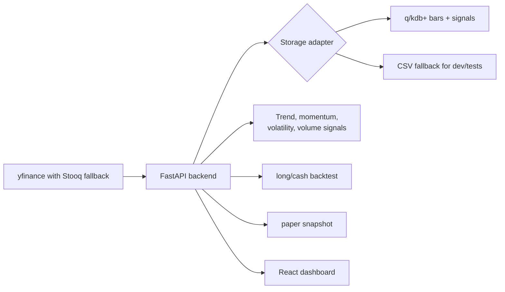

# LLM Handoff: Model Trading Bot

This document is for another LLM or engineer picking up the repo without the original chat context. It explains what exists, how the pieces fit, how to run and verify it, and what is intentionally incomplete.

## Project Intent

The repo is a toy algorithmic trading system that mimics the shape of a financial market-data stack:

- Fetch free historical equity data for a small FAANG-style universe.
- Store daily bars and calculated signals in KDB/q.
- Expose ingestion, signal, backtest, and paper-trading APIs through FastAPI.
- Display the system state in a React dashboard.
- Containerize backend, frontend, and KDB services for Docker Compose and Kubernetes.

This is educational software only. It does not execute real trades and should not be treated as investment advice.

## Current State

The scaffold is implemented end to end:

- `backend/`: FastAPI app, data providers, indicators, storage adapters, backtest, paper snapshot, tests.
- `kdb/`: q schema and container entrypoint for bars/signals persistence.
- `frontend/`: React/Vite/Recharts dashboard.
- `infra/k8s/`: plain Kubernetes YAML for namespace, config, KDB StatefulSet, backend/frontend deployments, services, ingress.
- `docker-compose.yml`: local multi-container topology.
- `README.md`: user-facing run/deploy notes.

The local machine used during creation did not have a usable KX q binary or KDB Docker base image. KDB files were authored but not executed. Backend tests and frontend build were executed successfully.

## Important Environment Facts From Creation

- Workspace path: `C:\Users\chris\Projects\model-trading-bot`
- Host Python available during verification: Python 3.14.4
- Backend Dockerfile uses Python 3.12 slim for safer dependency compatibility.
- Host Node available through Codex bin: Node 24.14.0
- Host had no global `npm`, `pnpm`, or `corepack` on PATH.
- Frontend was verified using a temporary `@pnpm/exe` download, then `pnpm run build`.
- Docker CLI and Compose were installed, but Docker Desktop Linux engine returned a 500 on `_ping`, so container builds were not verified.

## Architecture



## Backend Details

Entry point:

- `backend/app/main.py`

Key modules:

- `backend/app/config.py`: environment-driven settings.
- `backend/app/services/data_provider.py`: `YFinanceProvider`, `StooqProvider`, `FallbackProvider`.
- `backend/app/services/signals.py`: trend, momentum, volatility, and volume indicators plus a transparent scorecard.
- `backend/app/services/strategies.py`: built-in strategy registry, custom scorecard normalization, and dynamic strategy application.
- `backend/app/services/auth.py`: shared local SQLite login store plus model-trading-bot user profiles, saved scorecards, and paper portfolio snapshots.
- `backend/app/services/backtest.py`: long/cash backtest with fee/slippage, equity curve, drawdown, Sharpe, trades.
- `backend/app/services/paper.py`: one-step paper portfolio allocation from latest signals.
- `backend/app/storage/local.py`: CSV storage adapter for local/dev/test use.
- `backend/app/storage/kdb.py`: PyKX IPC storage adapter for q/KDB.

Main API routes:

- `GET /health`
- `POST /api/auth/login`
- `GET /api/auth/me`
- `GET /api/user/state`
- `GET /api/user/strategies`
- `POST /api/user/strategies`
- `DELETE /api/user/strategies/{strategy_id}`
- `POST /api/user/account/reset`
- `GET /api/symbols`
- `POST /api/symbols`
- `POST /api/ingest`
- `GET /api/strategies`
- `GET /api/strategy`
- `GET /api/signals/catalog`
- `GET /api/signals/latest`
- `GET /api/explain/{symbol}`
- `GET /api/diagnostics`, including `age_days` and `stale` for bar and signal frames
- `GET /api/universe/sp500`
- `POST /api/universe/sp500/refresh`
- `GET /api/overview`
- `GET /api/timeseries/{symbol}`
- `POST /api/backtests`
- `POST /api/backtests/compare`
- `POST /api/paper/run`
- `GET /api/paper/portfolio`

Default watched symbols:

- `AAPL, AMZN, META, NFLX, GOOGL`

S&P 500 universe:

- `backend/app/services/universe.py` scrapes the current S&P 500 constituent table from Wikipedia and caches it under `LOCAL_DATA_DIR/universe/sp500.json`.
- The cache refresh cadence is controlled by `SP500_REFRESH_HOURS`; startup refresh is controlled by `UNIVERSE_REFRESH_ON_STARTUP`.
- The app uses this as a ticker discovery/autocomplete universe, but still fetches price history only for watched symbols to avoid punishing free data providers.

Strategy layer:

- `backend/app/services/signals.py` calculates shared indicator columns and base component scores.
- `backend/app/services/strategies.py` dynamically applies a selected strategy to those stored indicator columns.
- `backend/app/services/auth.py` stores saved user scorecards as `user_strategy_{id}` entries in the same strategy list returned by `GET /api/strategies`.
- Built-ins: `multi_factor_scorecard`, `trend_breakout`, `mean_reversion`, `momentum_rotation`, `low_volatility_trend`.
- Custom: `custom_scorecard`, a validated rule template with score, RSI, SMA 20, MACD, ADX, and momentum filters.
- GET endpoints accept `strategy_id` query params; custom GET usage also accepts `custom_name`, `min_signal_score`, `max_rsi`, `min_rsi`, `require_above_sma20`, `require_positive_macd`, `min_adx`, and `min_momentum_score`.
- `POST /api/backtests` and `POST /api/paper/run` accept `strategy_id` and `custom_strategy` in the request body.
- Position is shifted one bar in the backtest to reduce lookahead bias.
- `signal_reason` stores a compact text explanation for the latest component scores.

Shared auth:

- Local username-only auth is backed by SQLite at `SHARED_AUTH_DB`, defaulting to `~/.local-webapps/auth.db` outside containers.
- The shared table is `users`; model-trading-bot owns app-specific tables prefixed with `model_trading_bot_`.
- `local-llm` and `trading-bot` were updated in sibling repos to use the same `SHARED_AUTH_DB` convention.
- Frontend localStorage uses `sharedLocalUser` plus an app-specific fallback key.

## KDB Details

Files:

- `kdb/q/init.q`
- `kdb/q/schema.q`
- `kdb/Dockerfile`

Tables:

- `bars`: `date`, `sym`, `open`, `high`, `low`, `close`, `adj_close`, `volume`, `source`
- `signals`: daily close plus returns, EMA, SMA, RSI, MACD, Bollinger Bands, ATR, realized volatility, stochastic, Williams %R, CCI, ADX/+DI/-DI, OBV, volume z-score, rolling VWAP, 20-day momentum, 12-1 month momentum, z-score, Donchian, Keltner, gap/intraday returns, 52-week-high distance, component scores, `signal_score`, `signal_reason`, `trade_signal`, `position`

q functions called by the backend:

- `.bot.upsertBars`
- `.bot.upsertSignals`

Persistence:

- KDB service persists tables under `KDB_DATA_DIR`, default `/data/kdb`.

Important limitation:

- The KDB container needs a valid KX base image and license directory. `.env.example` uses `KDB_BASE_IMAGE=kdb-insights-core:latest` as a placeholder. A real environment must provide the image and mount license files via `QLIC`.

## Frontend Details

Files:

- `frontend/src/App.tsx`
- `frontend/src/api.ts`
- `frontend/src/types.ts`
- `frontend/src/styles.css`

Stack:

- React 18
- Vite
- TypeScript
- Recharts
- lucide-react

Dashboard capabilities:

- Symbol selection
- Add ticker flow that calls `POST /api/symbols`
- S&P 500 universe sync/autocomplete
- Data refresh trigger
- Global strategy selector
- Four pages: Home, Stock, Signals, Backtesting
- Home page Trading System Walkthrough with interactive data/signals/strategy/backtest/paper stages and live readouts
- Home page Operations snapshot that surfaces storage health, shared-login health, bar/signal freshness, and S&P 500 cache status from `/api/diagnostics`
- Interactive price chart with range selection, SMA/Bollinger/Keltner/position layer toggles, hover tooltips, brush zoom, and principle cards
- MACD chart
- RSI chart
- Stochastic chart
- Algorithm score transparency panel
- Signal Trend Explorer on the Signals page with signal chips, presets, normalized/raw scaling, position overlay, hover tooltips, legend, and brush zoom
- Expandable signal catalog and latest full signal matrix
- Backtest equity chart with strategy/benchmark/drawdown/position layer toggles and brush zoom
- Trade Anatomy panel for stepping through simulated trade events and the backtest accounting flow
- Strategy Comparison panel on Backtesting that calls `/api/backtests/compare` for a compact built-in/custom strategy leaderboard
- Custom strategy scorecard builder on the Backtesting page
- Paper orders/equity snapshot

Nginx production container proxies `/api/` and `/health` to the backend service.

## Local Run Without KDB

Use the local CSV storage adapter:

```powershell
cd C:\Users\chris\Projects\model-trading-bot\backend
..\.venv\Scripts\Activate.ps1
$env:STORAGE_BACKEND="local"
$env:LOCAL_DATA_DIR="C:\Users\chris\Projects\model-trading-bot\data\local"
$env:BOOTSTRAP_ON_STARTUP="false"
$env:AUTO_INGEST_ON_EMPTY="true"
uvicorn app.main:app --reload --port 8000
```

Frontend:

```powershell
cd C:\Users\chris\Projects\model-trading-bot\frontend
pnpm install
pnpm run dev -- --host 127.0.0.1 --port 5173
```

URLs:

- Frontend: `http://localhost:5173`
- Backend docs: `http://127.0.0.1:8000/docs`

## Docker Compose Run

Prerequisites:

- Docker Desktop Linux engine running.
- A valid KDB base image available locally or pullable.
- A valid KX license directory mounted through `QLIC`.

```powershell
Copy-Item .env.example .env
# Edit .env with real KDB_BASE_IMAGE and QLIC values.
docker compose up --build
```

URLs:

- Frontend: `http://localhost:8080`
- Backend docs: `http://localhost:8000/docs`
- KDB IPC: `localhost:5000`

## Kubernetes Run

Manifests live in `infra/k8s/`.

Before applying:

- Build and push `model-trading-bot-kdb`, `model-trading-bot-backend`, and `model-trading-bot-frontend`.
- Replace `:local` image names in the manifests with registry image names.
- Create a `kdb-license` secret if using KDB:

```powershell
kubectl create namespace model-trading-bot
kubectl -n model-trading-bot create secret generic kdb-license --from-file=kc.lic=path\to\kc.lic
kubectl apply -f infra/k8s
```

Ingress host:

- `trading-bot.local`

## Verification Already Run

Backend tests:

```powershell
cd backend
..\.venv\Scripts\python -m pytest
```

Result:

- `2 passed`

Backend smoke test:

- Used `STORAGE_BACKEND=local`
- Fetched AAPL historical data through the provider stack.
- Stored 123 bars/signals.
- Ran the long/cash backtest.
- Example result at the time: `total_return` around `0.1347`, `trades` 8 for a 6-month AAPL smoke run.
- S&P 500 universe refresh returned 503 current listings on 2026-05-16.

Frontend build:

```powershell
cd frontend
pnpm run build
```

Result:

- TypeScript build and Vite production build passed.
- Vite emitted a chunk-size warning because Recharts and app code land in one bundle. This is acceptable for the mock-up.

API smoke through Vite proxy:

- `GET http://localhost:5173/api/overview` returned current FAANG-style rows.
- `POST http://localhost:5173/api/backtests` for `AAPL` returned metrics, equity curve, and trades.

KDB verification:

- Not run. No q binary was installed and Docker Desktop Linux engine was unavailable.

## Known Issues And Follow-Ups

1. KDB needs real runtime verification.
   - Start with a licensed q image.
   - Run `docker compose up kdb backend`.
   - Exercise `POST /api/ingest`.
   - Confirm `bars` and `signals` persist across KDB restarts.

2. q syntax should be reviewed by someone with local q available.
   - The q schema is intentionally minimal.
   - Pay special attention to `.bot.path`, file persistence, and PyKX table type conversions.

3. Frontend package manager expectation is `pnpm`.
   - `frontend/package.json` includes `packageManager: pnpm@11.1.1`.
   - Dockerfile uses Corepack and pnpm.

4. Strategy is deliberately basic.
   - Next useful improvements: persisted custom strategies, richer expression DSL, parameterized indicator windows, symbol basket backtests, transaction lots, cash accounting, benchmark selection, walk-forward periods.

5. Observability is minimal.
   - Add structured logs, request IDs, Prometheus metrics, and KDB query timing if turning this into a richer learning project.

6. Data-provider reliability is best-effort.
   - `yfinance` is convenient but unofficial; Stooq is a fallback for daily data.
   - For more realistic systems, add provider abstraction tests, retry/backoff, cache metadata, and corporate-action handling.

7. Security is intentionally light.
   - No auth is implemented.
   - Do not expose this publicly without auth, rate limiting, secret management, image scanning, and network policy.

## Research Context

The current signal set is a pragmatic educational blend, not a claim of production alpha. Useful references behind the implemented families:

- Brock, Lakonishok & LeBaron (1992): moving-average and trading-range technical rules. https://ideas.repec.org/a/bla/jfinan/v47y1992i5p1731-64.html
- Lo, Mamaysky & Wang (2000): computational/statistical framing for technical analysis. https://web.mit.edu/wangj/www/pap/LoMamayskyWang00.pdf
- Jegadeesh & Titman (1993): 3- to 12-month cross-sectional momentum. https://doi.org/10.1111/j.1540-6261.1993.tb04702.x
- Moskowitz, Ooi & Pedersen (2012): time-series momentum/trend. https://www.aqr.com/insights/research/journal-article/time-series-momentum
- Hurst, Ooi & Pedersen (2017): long-run trend-following evidence. https://www.aqr.com/insights/research/journal-article/a-century-of-evidence-on-trend-following-investing
- Han, Yang & Zhou (2013): cross-sectional profitability of moving-average technical analysis. https://www.cambridge.org/core/product/identifier/S0022109013000586/type/journal_article

## Recommended Next LLM Task

If another LLM picks this up, the next best task is:

1. Run with a real KDB image/license.
2. Fix any q/PyKX IPC conversion issues.
3. Add integration tests that use a running KDB service.
4. Add CI that runs backend tests and frontend build.
5. Expand `/api/diagnostics` with request timing or provider status if this becomes a daily operations tool.
6. Add a short demo script that performs ingest, overview, diagnostics, backtest, and paper calls.

## Files To Avoid Committing

Already covered by `.gitignore`:

- `.venv/`
- `data/`
- `qlic/`
- `frontend/node_modules/`
- `frontend/dist/`
- Python cache directories
- TypeScript build info
