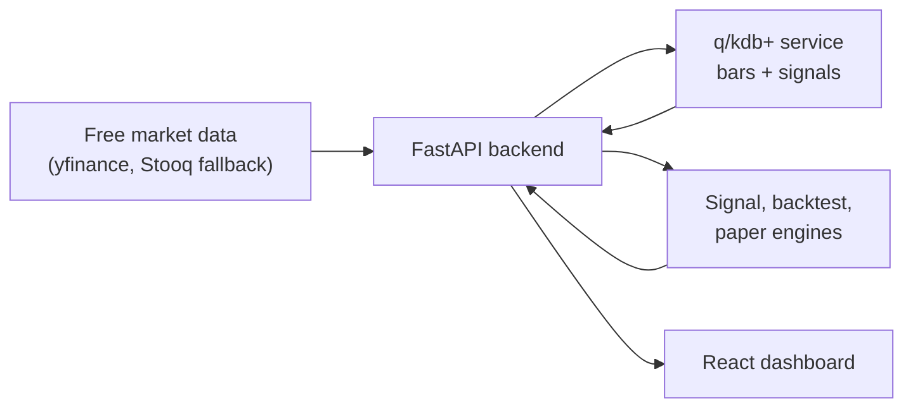

# Model Trading Bot

A toy algorithmic trading system for learning the shape of a modern market-data stack:

- Free daily equity data for a watched basket, with a cached S&P 500 ticker universe for discovery.
- q/kdb+ storage service for time-series market data and calculated signals.
- FastAPI orchestration layer for ingestion, indicators, backtesting, and paper trading.
- React dashboard split into Home, Stock, Signals, and Backtesting pages.
- Docker Compose and Kubernetes manifests for deployment practice.

This is educational software, not investment advice and not a production trading system.

## Architecture



For future maintainers and LLM handoffs, see [LLM_HANDOFF.md](./LLM_HANDOFF.md).

## Project Layout

```text
backend/        FastAPI app, data providers, indicators, storage adapters, tests
kdb/            q schema and container entrypoint for kdb+
frontend/       React/Vite dashboard served by nginx
infra/k8s/      Kubernetes namespace, services, deployments, stateful set, ingress
docker-compose.yml
.env.example
Makefile
```

## KDB Notes

KDB is commercial software. The q service in this repo is real q code, but you need a valid KX image/license to run it. The Dockerfile expects a base image that has `q` available on `PATH` or at `/opt/kx/kdb/l64/q`, and Compose mounts your license directory into `/tmp/qlic`.

For local experimentation:

1. Put your KX license file in a local directory, for example `./qlic/kc.lic`.
2. Set `KDB_BASE_IMAGE` in `.env` to the KX image you can use.
3. Run `docker compose up --build`.

The backend also has a local CSV storage adapter so tests and UI development can run without a KDB license:

```powershell
$env:STORAGE_BACKEND="local"
```

## Shared Local Login

`model-trading-bot` uses a lightweight shared SQLite login database for local apps. Set `SHARED_AUTH_DB` to the same file path in `model-trading-bot`, `local-llm`, and `trading-bot`; without an override it defaults to `~/.local-webapps/auth.db` for non-container local runs.

The current login is intentionally username-only to match the existing `local-llm` flow. It is suitable for a trusted local lab, not public deployment. The numeric `user_id` from this shared database is used to scope model-trading-bot saved scorecards and paper portfolio snapshots.

## Quick Start

```powershell
Copy-Item .env.example .env
docker compose up --build
```

Then open:

- Frontend: http://localhost:8080
- Backend API: http://localhost:8000/docs
- KDB IPC: `localhost:5000`

If you are working without KDB:

```powershell
cd backend
python -m venv .venv
.\.venv\Scripts\Activate.ps1
pip install -r requirements.txt -r requirements-dev.txt
python -m playwright install chromium
$env:STORAGE_BACKEND="local"
uvicorn app.main:app --reload --port 8000
```

In another shell:

```powershell
cd frontend
pnpm install
pnpm run dev -- --host 127.0.0.1 --port 5173
```

## API Flow

The dashboard calls:

- `POST /api/auth/login`, `GET /api/auth/me`, and `GET /api/user/state` for the shared local user.
- `POST /api/user/strategies` and `GET /api/user/strategies` for per-user saved scorecard strategies.
- `POST /api/user/account/reset` to reset a model-trading-bot account back to default paper/account state.
- `GET /api/symbols` to list default and stored symbols.
- `POST /api/symbols` to add and ingest new tickers.
- `GET /api/universe/sp500` and `POST /api/universe/sp500/refresh` to view or re-poll S&P 500 constituents.
- `POST /api/ingest` to fetch bars, write bars/signals, and refresh the store.
- `GET /api/strategies` and `GET /api/strategy` for algorithm metadata, strategy menu options, and score components.
- `GET /api/signals/catalog` and `GET /api/signals/latest` for expandable signal descriptions and the latest full signal matrix.
- `GET /api/explain/{symbol}` for the latest component-level explanation.
- `GET /api/overview` for latest cross-symbol state.
- `GET /api/diagnostics` for a dashboard-ready storage, auth, data freshness, and S&P cache snapshot.
- `GET /api/timeseries/{symbol}` for price, indicator, position, and signal-trend chart data.
- `POST /api/backtests` for the selected long/cash strategy.
- `POST /api/paper/run` and `GET /api/paper/portfolio` for a user-scoped paper account snapshot using the selected strategy.

Default watched symbols are `AAPL,AMZN,META,NFLX,GOOGL`. The S&P 500 universe is cached separately and periodically refreshed with `SP500_REFRESH_HOURS` so ticker discovery does not require fetching price history for all 500+ listings on every page load.

## Strategy

The toy strategy layer is intentionally simple but now supports a strategy registry:

- Built-in strategies: balanced scorecard, trend breakout, mean reversion, time-series momentum, and low-volatility trend.
- Custom strategy: a constrained scorecard builder with score, RSI, SMA 20, MACD, ADX, and momentum filters; signed-in users can save named scorecards and select them from the global strategy menu.
- Shared indicators: SMA/EMA, MACD, ADX/+DI/-DI, Donchian, RSI, stochastic, Williams %R, CCI, Bollinger Bands, Keltner Channels, ATR, realized volatility, OBV, volume z-score, rolling VWAP, 20-day momentum, and 12-1 month momentum.
- Home page walkthrough: an interactive stage explorer that connects data ingestion, signal calculation, strategy rules, backtesting, and paper trading to the current app state.
- Stock page chart controls: range selection, layer toggles, brush zoom, hover tooltips, and principle cards for trend, momentum, model stance, and visible bars.
- Signals page trend explorer: interactive line chart for every stored signal with symbol switching, presets, raw versus normalized scale, position overlay, hover tooltips, legend, and brush zoom.
- Backtesting page education: equity, benchmark, drawdown, and position toggles plus a trade anatomy panel that steps through simulated trade events.
- Backtest uses next-day position application, a fee/slippage haircut, benchmark comparison, Sharpe, max drawdown, and trade list.

Real trading systems commonly ingest algorithms as versioned source modules, reviewed configuration files, parameter sets for approved strategy templates, notebook research promoted into production code, or restricted DSL/rule expressions. This toy app uses the safer template/config route: built-ins are Python strategy functions, while the custom strategy UI sends a validated scorecard configuration instead of arbitrary executable code.

The signal set is influenced by classic technical-analysis and momentum literature, including [Brock, Lakonishok & LeBaron](https://ideas.repec.org/a/bla/jfinan/v47y1992i5p1731-64.html) on moving-average and trading-range rules, [Lo, Mamaysky & Wang](https://web.mit.edu/wangj/www/pap/LoMamayskyWang00.pdf) on statistical technical-analysis foundations, [Jegadeesh & Titman](https://doi.org/10.1111/j.1540-6261.1993.tb04702.x) on cross-sectional momentum, [Moskowitz, Ooi & Pedersen](https://www.aqr.com/insights/research/journal-article/time-series-momentum) on time-series momentum, [Hurst, Ooi & Pedersen](https://www.aqr.com/insights/research/journal-article/a-century-of-evidence-on-trend-following-investing) on long-run trend following, and [Han, Yang & Zhou](https://www.cambridge.org/core/product/identifier/S0022109013000586/type/journal_article) on cross-sectional profitability of moving-average technical analysis.

## Operations Snapshot

The Home page includes an Operations panel backed by `GET /api/diagnostics`. It shows whether local storage and shared login are healthy, whether stored market bars and calculated signals are fresh or stale, and whether the cached S&P 500 universe is available or stale. Bar and signal freshness uses the latest stored row date plus a three-day calendar tolerance so weekends do not immediately create noisy alerts. The diagnostics endpoint reads the existing universe cache status without forcing an internet refresh, so loading the dashboard stays fast even when Wikipedia or the network is unavailable.

## Kubernetes

The manifests in `infra/k8s` are deliberately plain YAML so the moving parts are visible. Build and push your images, update image names in the manifests, create a license secret for KDB, then apply:

```powershell
kubectl apply -f infra/k8s
```

For real environments, add proper secrets management, network policies, observability, CI image scanning, and persistent backup policies for KDB data.
