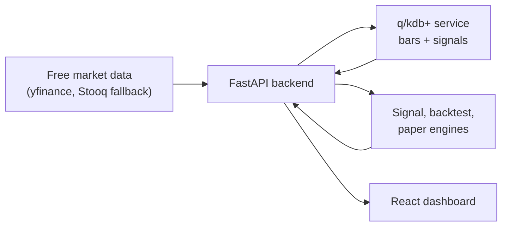

# Model Trading Bot

A toy algorithmic trading system for learning the shape of a modern market-data stack:

- Free daily equity data for a small FAANG-style basket.
- q/kdb+ storage service for time-series market data and calculated signals.
- FastAPI orchestration layer for ingestion, indicators, backtesting, and paper trading.
- React dashboard for prices, MACD, RSI, positions, and backtest metrics.
- Docker Compose and Kubernetes manifests for deployment practice.

This is educational software, not investment advice and not a production trading system.

## Architecture



For future maintainers and LLM handoffs, see [LLM_HANDOFF.md](./LLM_HANDOFF.md).

## Project Layout

```text
backend/        FastAPI app, data providers, indicators, storage adapters, tests
kdb/            q schema and container entrypoint for kdb+
frontend/       React/Vite dashboard served by nginx
infra/k8s/      Kubernetes namespace, services, deployments, stateful set, ingress
docker-compose.yml
.env.example
Makefile
```

## KDB Notes

KDB is commercial software. The q service in this repo is real q code, but you need a valid KX image/license to run it. The Dockerfile expects a base image that has `q` available on `PATH` or at `/opt/kx/kdb/l64/q`, and Compose mounts your license directory into `/tmp/qlic`.

For local experimentation:

1. Put your KX license file in a local directory, for example `./qlic/kc.lic`.
2. Set `KDB_BASE_IMAGE` in `.env` to the KX image you can use.
3. Run `docker compose up --build`.

The backend also has a local CSV storage adapter so tests and UI development can run without a KDB license:

```powershell
$env:STORAGE_BACKEND="local"
```

## Quick Start

```powershell
Copy-Item .env.example .env
docker compose up --build
```

Then open:

- Frontend: http://localhost:8080
- Backend API: http://localhost:8000/docs
- KDB IPC: `localhost:5000`

If you are working without KDB:

```powershell
cd backend
python -m venv .venv
.\.venv\Scripts\Activate.ps1
pip install -r requirements.txt -r requirements-dev.txt
$env:STORAGE_BACKEND="local"
uvicorn app.main:app --reload --port 8000
```

In another shell:

```powershell
cd frontend
pnpm install
pnpm run dev -- --host 127.0.0.1 --port 5173
```

## API Flow

The dashboard calls:

- `GET /api/symbols` to list default and stored symbols.
- `POST /api/symbols` to add and ingest new tickers.
- `POST /api/ingest` to fetch bars, write bars/signals, and refresh the store.
- `GET /api/strategy` for algorithm metadata and score components.
- `GET /api/explain/{symbol}` for the latest component-level explanation.
- `GET /api/overview` for latest cross-symbol state.
- `GET /api/timeseries/{symbol}` for chart data.
- `POST /api/backtests` for a simple long/cash MACD/RSI strategy.
- `POST /api/paper/run` for a one-step paper account snapshot.

Default symbols are `AAPL,AMZN,META,NFLX,GOOGL`.

## Strategy

The toy strategy is intentionally simple but now uses a transparent scorecard:

- Trend: close vs SMA 50, SMA 20 vs SMA 50, MACD histogram.
- Momentum: RSI 14, stochastic %K/%D, 20-day price momentum.
- Volatility: Bollinger Bands, ATR percentage vs recent baseline.
- Volume: volume z-score and OBV direction.
- Long when score is at least 4, close is above SMA 20, and RSI is below 78.
- Cash otherwise.
- Backtest uses next-day position application, a fee/slippage haircut, benchmark comparison, Sharpe, max drawdown, and trade list.

## Kubernetes

The manifests in `infra/k8s` are deliberately plain YAML so the moving parts are visible. Build and push your images, update image names in the manifests, create a license secret for KDB, then apply:

```powershell
kubectl apply -f infra/k8s
```

For real environments, add proper secrets management, network policies, observability, CI image scanning, and persistent backup policies for KDB data.
